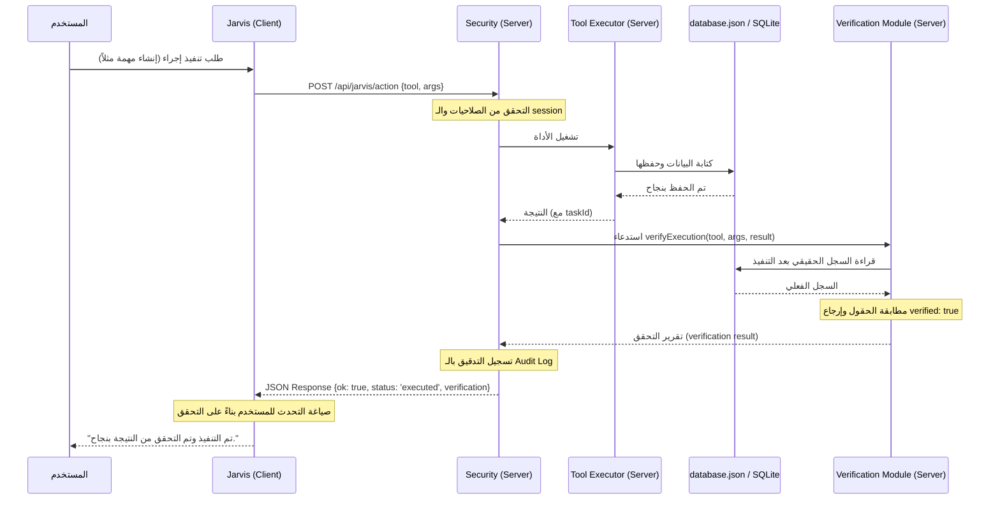

# OMNI JARVIS POST-EXECUTION READ-BACK VERIFICATION REPORT

## 1. Summary
تم بنجاح إضافة ميزة "التحقق بعد التنفيذ" (Post-Execution Verification) للمساعد الذكي Jarvis. عند استدعاء أي أداة كتابة (Write tool)، لا يعتمد النظام على القيمة الراجعة من المنفذ فقط أو حالة العميل المحلية، وإنما يقوم الخادم تلقائياً بإعادة قراءة قاعدة البيانات الحقيقية (SQLite أو JSON) للتحقق الفعلي من إتمام العملية ومطابقة القيم المدخلة.

## 2. Files Changed
| File | Change | Reason |
|---|---|---|
| `server-jarvis-verification.js` | `[NEW]` | يحتوي على منطق التحقق، مقارنة قيم قاعدة البيانات، وإرجاع هيكلية التحقق. |
| `server-jarvis-security.js` | `[MODIFY]` | استدعاء دالة التحقق بعد تنفيذ العمليات مباشرة في مسارات `/action` و `/execute-approved` وتحديث حالة الموافقة والتدقيق. |
| `modules/jarvis-brain.js` | `[MODIFY]` | تعديل دالة `compose()` لتقرأ نتيجة التحقق ديناميكياً وتحديث منطق الصياغة اللفظية. |
| `scripts/jarvis-post-execution-verification-smoke.mjs` | `[NEW]` | اختبار Smoke الجديد لتغطية جميع أدوات الكتابة والتحقق من النتيجة. |

## 3. Verification Architecture
1. **خطة التحقق (Verification Plan)**: عند إتمام كتابة أي أداة، يُصدر النظام تقرير تحقق بالهيكلية التالية:
   - `verified`: هل العملية صحيحة ومؤكدة بالكامل في قاعدة البيانات الحقيقية؟ (`true` / `false` / `null` إذا كان التحقق غير متوفر للأداة).
   - `confidence`: مستوى الموثوقية (`high` / `medium` / `low`).
   - `checks`: قائمة بالاختبارات التفصيلية التي جرت مثل وجود السجل في قاعدة البيانات ومطابقة حقول العناوين أو الأرقام.
2. **قراءة قاعدة البيانات الحقيقية (Real DB Read-back)**: يتم تحميل قاعدة البيانات الحالية للتحقق من السجلات المُعدلة دون الاعتماد على بيانات ممررة من المتصفح.

## 4. Tool Coverage
| Tool | Verification Method | Status | Limitations |
|---|---|---|---|
| `create_task` | البحث عنTaskId ومطابقة العنوان (Title) | مؤكد بالكامل (High) | - |
| `create_customer` | البحث عن CustomerId ومطابقة الاسم | مؤكد بالكامل (High) | - |
| `add_customer_debt` | التأكد من وجود المعاملة المالية ومطابقة المبلغ | مؤكد بالكامل (High) | - |
| `record_customer_payment` | التأكد من وجود المعاملة المالية ومطابقة المبلغ | مؤكد بالكامل (High) | - |
| `create_purchase_expense` | التأكد من وجود المعاملة المالية ومطابقة المبلغ | مؤكد بالكامل (High) | - |
| `create_sales_receipt` | التأكد من وجود المعاملة المالية ومطابقة المبلغ | مؤكد بالكامل (High) | - |
| `modify_material` | التحقق من مطابقة الكلفة والمخزون المعدل في جدول المواد | مؤكد بالكامل (High) | - |
| `modify_employee` | التحقق من مطابقة الراتب الأساسي والدور المعدل في جدول الموظفين | مؤكد بالكامل (High) | - |
| `create_journal_entry` | التحقق من وجود القيد المالي المؤقت وحالته `awaiting_finance_engine` | مؤكد بالكامل (High) | لا يتم الترحيل الفعلي لدفتر الأستاذ مباشرة لأسباب سلامة Ledger. |
| `execute_js_mutation` | التحقق من الرفض التام وعدم التشغيل | مؤكد بالكامل (High) | الأداة معطلة لأسباب أمنية. |

## 5. Action Flow After Sprint

## 6. Approval Verification Flow
- عند تنفيذ أمر معتمد من المدير عبر `/api/jarvis/execute-approved`:
  1. يقوم النظام بقراءة السجل من `server-ai-approvals.json` وإعادة تفعيل التحقق.
  2. يُشغل المنفذ (Executor) باستخدام الحجج (Args) الأصلية المعتمدة فقط لمنع تبديل المعاملات.
  3. يجري التحقق الفعلي للتأكد من تعديل حالة الموافقة إلى `executed` أو `executed_unverified` في قائمة الموافقات لمنع تكرار التشغيل (Double execution).

## 7. Jarvis Response Behavior
يتحدث Jarvis بأسلوب مختلف بناءً على حالة التحقق:
- **تم التحقق بنجاح (`verified: true`)**: "تم التنفيذ وتم التحقق من النتيجة."
- **فشل التحقق (`verified: false`)**: "تم إرسال التنفيذ، لكن لم أقدر أؤكد النتيجة من قاعدة البيانات." (مع تفصيل التحذيرات).
- **التحقق غير متوفر (`verified: null`)**: "اكتمل الإجراء، لكن التحقق التلقائي غير متوفر لهذه الأداة."

## 8. Smoke Test Results
- `jarvis-post-execution-verification-smoke.mjs`: **PASS (15/15)**
- `jarvis-kb-rag-smoke.mjs`: **PASS (8/8)**
- `jarvis-server-side-mutations-smoke.mjs`: **PASS (22/22)**
- `jarvis-click-ui-hardening-smoke.mjs`: **PASS (24/24)**

## 9. Remaining Risks
- **العمليات خارج Jarvis**: أي عمليات حفظ مباشرة من واجهة المستخدم القديمة (Direct UI saveData paths) لا تمر عبر بوابة التحقق هذه.
- **تأخر الترحيل المالي**: القيود الحسابية تظل معلقة `awaiting_finance_engine` مما يعني أن التحقق يؤكد الكتابة المؤقتة فقط وليس التأثير النهائي على شجرة الحسابات.

## 10. Next Sprint Recommendation
التوصيات للسبرنت القادم:
1. **Durable memory**: تزويد Jarvis بذاكرة مستمرة لتخزين تفضيلات وسياق المستخدم.
2. **DOM reader hardening**: زيادة الحماية على عناصر الواجهة وقراءة الشاشة.
3. **Server-side APIs for old UI**: توفير بوابات تنفيذ موحدة لبقية الأقسام القديمة.
